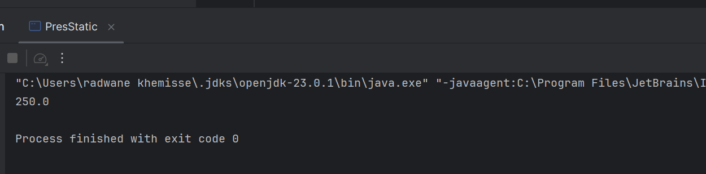
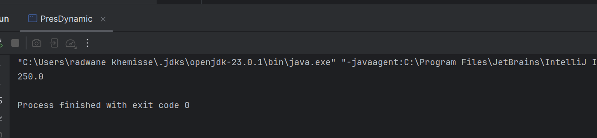

# TP1 - Injection des dépendances

## Introduction

Le but de ce TP est de mettre en pratique le concept d’injection de dépendances en Java. Nous allons commencer par créer deux interfaces (`IDao` et `IMetier`) ainsi que leurs implémentations, puis nous verrons différentes manières d’injecter les dépendances :
- Par instanciation statique (couplage fort)
- Par instanciation dynamique (réflexion)
- en uilisant le Framework Spring

---

## 1. Création de l’interface `IDao` avec la méthode `getData()`

    public interface IDao {
        double getData();
    }

## 2. Création d’une implémentation de l’interface `IDao`

Ici, nous créons une classe concrète `DaoImpl` qui fournit une implémentation de la méthode `getData`. 

    public class DaoImpl implements IDao {

        @Override
        public double getData() {
            return 10;
        }
    }

## 3. Création de l’interface `IMetier` avec la méthode `calcul()`

    public interface IMetier {
    double calcul();
    }

## 4. Création d’une implémentation de `IMetier` (couplage faible)

La classe `MetierImpl` dépend de l’interface `IDao`.
> - Par constructeur : `public MetierImpl(IDao dao)`
> - Par setter : `public void setDao(IDao dao)`

    public class MetierImpl implements IMetier {
        private IDao dao;

        public MetierImpl() {
        }

        public MetierImpl(IDao dao) {
            this.dao = dao;
        }

        @Override
        public double calcul() {
            double data = dao.getData();
            double res = data * 25;
            return res;
        }

        // Setter pour injection par setter
        public void setDao(IDao dao) {
            this.dao = dao;
        }
    }

---

## 5. Injection des dépendances

### 5.a. Par instanciation statique

Ici, nous créons manuellement les instances et les relions (DAO et Metier). 

    public class PresStatic {
        public static void main(String[] args) {
        DaoImpl dao = new DaoImpl();
        MetierImpl metier = new MetierImpl();
        metier.setDao(dao);
        System.out.println(metier.calcul());
        }
    }

---

### 5.b. Par instanciation dynamique (réflexion)

Avec cette approche, on lit le nom des classes à instancier depuis un fichier (ex. `config.txt`) et on utilise la réflexion (`Class.forName(...)`) pour charger et instancier les classes à l’exécution. Cela permet de changer l’implémentation sans recompiler.

    public class PresDynamic {
        public static void main(String[] args) {
        try {
            Scanner scanner = new Scanner(new File("config.txt"));
            String daoClassName = scanner.nextLine();
            Class cDao = Class.forName(daoClassName);
            IDao dao = (IDao) cDao.getConstructor().newInstance();

            String metierClassName = scanner.nextLine();
            Class cMetier = Class.forName(metierClassName);

            // Injection par constructeur
            IMetier metierC = (IMetier) cMetier.getConstructor(IDao.class).newInstance(dao);

            // Injection par setter
            IMetier metierS = (IMetier) cMetier.getConstructor().newInstance();
            Method setDao = cMetier.getMethod("setDao", IDao.class);
            setDao.invoke(metierS, dao);

            System.out.println(metierS.calcul());

        } catch (Exception e) {
            System.out.println(e.getMessage());
            }
        }
    }

---
